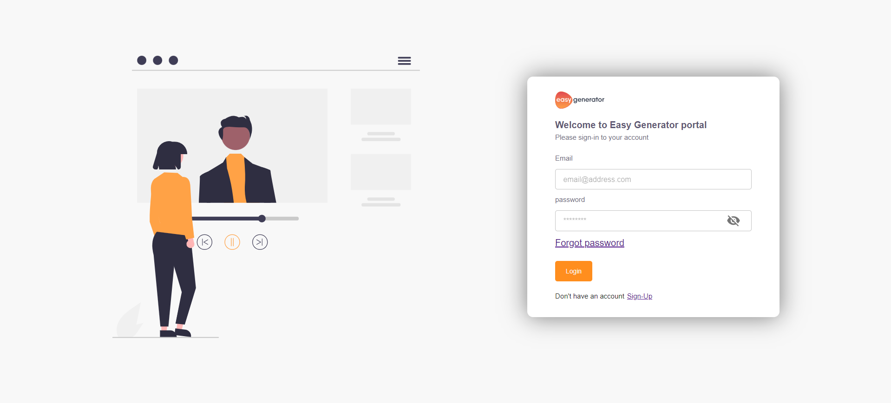
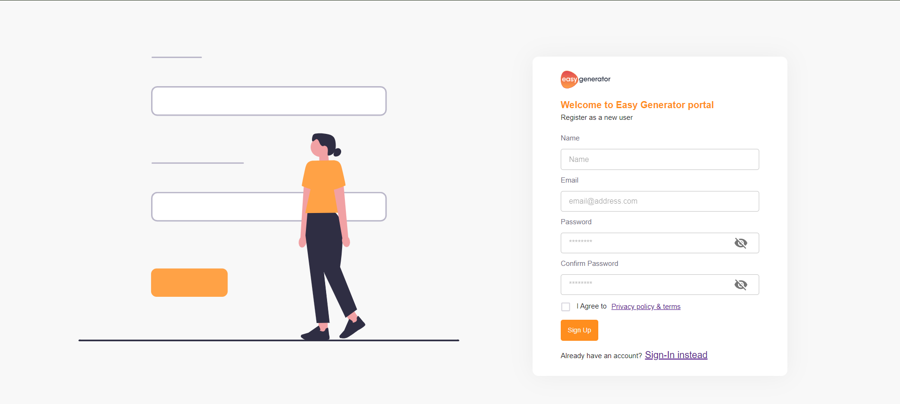
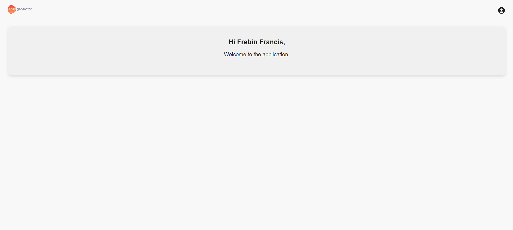

# Easy Generator Demo App

Welcome to the Easy Generator Demo App! This application is built with Vite, React, and TypeScript.

## Table of Contents

- [Introduction](#introduction)
- [Folder Structure](#folder-structure)
- [Getting Started](#getting-started)
- [Available Scripts](#available-scripts)
- [Contributing](#contributing)
- [License](#license)

## Introduction

This demo app showcases the capabilities of Vite, React, and TypeScript in building modern web applications. It includes various features and components that demonstrate best practices in front-end development.

## Application Screenshots


*Login Screen*


*Sign-Up Screen*


*Home Screen*

## Folder Structure

The project follows a standard folder structure:

```
easy-generator-demo-app/
│
├── src/
│   ├── app/
│   ├── assets/
│   │   ├── css/
│   │   └── images/
│   ├── components/
│   ├── configs/
│   ├── constants/
│   ├── containers/
│   ├── hoc/
│   ├── interfaces/
│   └── store/
│
├── public/
├── node_modules/
├── README.md
├── .env
├── package.json
└── ...
```

- **src/**: Contains the source code of the application.
  - **app/**: Main application code.
  - **assets/**: Static assets such as CSS files and images.
    - **css/**: CSS files for styling the application.
    - **images/**: Image files used in the application.
  - **components/**: Reusable React components used across the application.
  - **configs/**: Contains configuration files for the application.
  - **constants/**: Holds constant values used throughout the application.
  - **containers/**: Main Modules to render on the application.
  - **store/**: Contains files related to state management.

## Getting Started

To get started with the Easy Generator Demo App, follow these steps:

1. Clone this repository to your local machine:

   ```bash
   git clone <repository-url>
   ```

2. Navigate to the project directory:

   ```bash
   cd Demo-Portal-FrontEnd
   ```

3. Install dependencies:

   ```bash
   npm install
   ```

4. Start the development server:

   ```bash
   npm run dev
   ```

5. Open your browser and visit `http://localhost:4200` to view the application.

## Available Scripts

In the project directory, you can run:

- `npm run dev`: Starts the development server.
- `npm run build`: Builds the production-ready bundle.
- `npm run serve`: Serves the production build locally.

## Contributing

Contributions are welcome! If you have any ideas, suggestions, or improvements, feel free to open an issue or submit a pull request.

## License

This project is licensed under the [MIT License](LICENSE).
